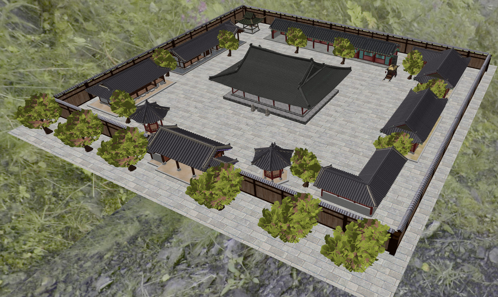
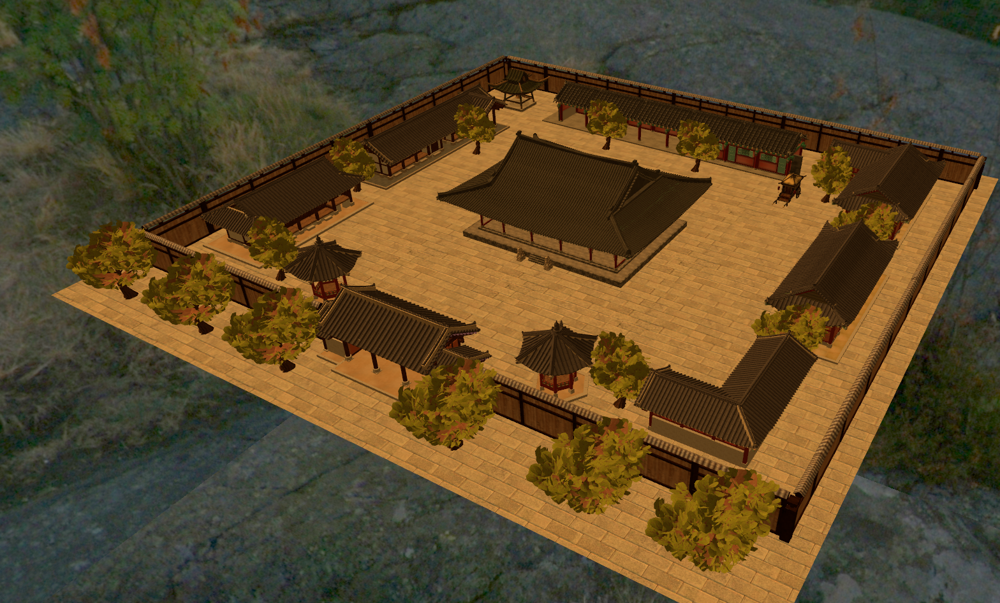
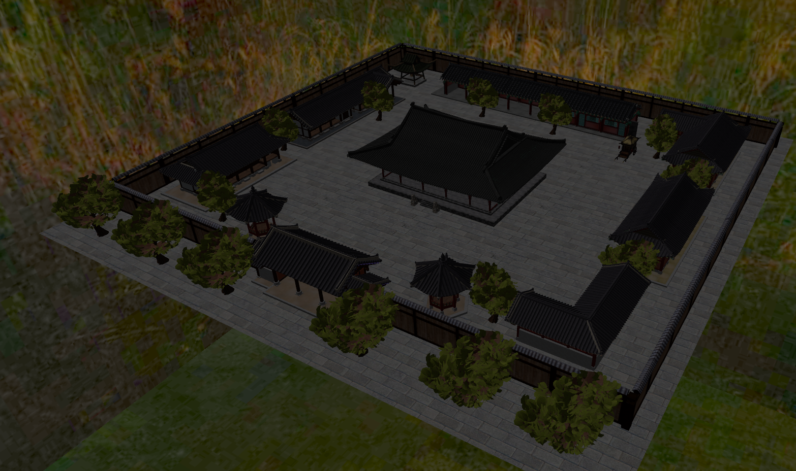

# OpenGL Temple Scene


An interactive 3D scene of a traditional Chinese temple complex, rendered in real time with modern OpenGL.
The user can explore the scene with the keyboard and mouse, switch between day, sunset and night,
and toggle effects such as fog and rain.

Developed as a university project for the **Graphics Processing** course
(Faculty of Automation and Computer Science, January 2025).

> [!IMPORTANT]
> This repository contains the **source code only**. The 3D models, textures, skybox images and GLSL shaders
> used by the original application are **not included** and are no longer available.
> The project compiles successfully, but the application stops at startup because it cannot load
> `assets/scene.obj`. See [Runtime Assets](#runtime-assets) for details.

---

## Table of Contents

- [About the Project](#about-the-project)
- [Screenshots](#screenshots)
- [Features](#features)
- [Controls](#controls)
- [Built With](#built-with)
- [Project Structure](#project-structure)
- [Getting Started](#getting-started)
  - [Prerequisites](#prerequisites)
  - [Building on Linux](#building-on-linux)
  - [Building on Windows](#building-on-windows)
  - [Runtime Assets](#runtime-assets)
- [Architecture](#architecture)
- [Documentation](#documentation)
- [License](#license)
- [Acknowledgments](#acknowledgments)
- [Author](#author)

---

## About the Project

The scene shows a temple complex surrounded by a wooden fence, with traditional Chinese buildings
(curved roofs, wooden structures), a central temple, smaller surrounding buildings, trees and a movable carriage.
The scene and its objects were assembled and textured in **Blender**, exported as `.obj` files
and rendered with a custom OpenGL application written in C++.

The goal of the project was to build a photorealistic, interactive scene that demonstrates
core real-time graphics techniques: textured models, directional and point lighting, a skybox,
fog, a particle system and camera navigation.

## Screenshots

| Day | Sunset | Night |
|:---:|:------:|:-----:|
|  |  |  |

## Features

- **Free camera navigation** — first-person movement with the keyboard and mouse look.
- **Scene transformations** — rotation of the whole scene and translation of an individual object (the carriage).
- **Time of day** — day, sunset and night modes, each with its own skybox, light color and fog color.
- **Lighting** — directional light combined with a point light with distance attenuation.
- **Fog** — exponential fog with adjustable density.
- **Rain** — a particle system of 500,000 particles rendered as points.
- **Rendering modes** — solid, wireframe and point rendering.
- **Presentation animation** — an automatic camera tour that rotates the scene continuously.
- **Textured models** — ambient, diffuse and specular textures loaded from `.mtl` materials.

## Controls

| Input | Action |
|-------|--------|
| `W` `A` `S` `D` | Move the camera forward / left / backward / right |
| Mouse | Look around |
| `Q` / `E` | Rotate the scene left / right |
| Arrow keys | Move the carriage |
| `O` | Toggle night mode (returns to day when pressed again) |
| `P` | Toggle sunset mode (returns to day when pressed again) |
| `Z` | Enable / disable fog |
| `X` / `C` | Increase / decrease fog density (hold; only while fog is enabled) |
| `R` | Enable / disable rain |
| `K` | Start / stop the automatic presentation animation |
| `1` / `2` / `3` | Wireframe / point / solid rendering |
| `Esc` | Exit the application |

## Built With

- [C++17](https://isocpp.org/)
- [OpenGL 4.1 Core Profile](https://www.opengl.org/)
- [GLFW](https://www.glfw.org/) — window creation and input
- [GLEW](https://glew.sourceforge.net/) — OpenGL extension loading
- [GLM](https://github.com/g-truc/glm) — mathematics for graphics
- [tinyobjloader](https://github.com/tinyobjloader/tinyobjloader) — `.obj` / `.mtl` parsing
- [stb_image](https://github.com/nothings/stb) — image loading
- [CMake](https://cmake.org/) — cross-platform build (Linux)
- [Blender](https://www.blender.org/) — scene modelling and texturing

## Project Structure

```
opengl-temple-scene/
├── src/                     Application source code
│   ├── main.cpp             Window creation, OpenGL state, main loop
│   ├── Scene.hpp/.cpp       Camera, models, input handling and rendering
│   ├── Lighting.hpp/.cpp    Time of day, lights and fog
│   ├── RainSystem.hpp/.cpp  Rain particle system
│   ├── Camera.hpp/.cpp      First-person camera
│   ├── Model3D.hpp/.cpp     .obj model loading and drawing
│   ├── Mesh.hpp/.cpp        Mesh geometry and GPU buffers
│   ├── Shader.hpp/.cpp      Shader program loading
│   ├── SkyBox.hpp/.cpp      Cube map skybox
│   └── GLUtils.hpp          OpenGL error checking
├── external/                Third-party single-header libraries
│   ├── stb_image.h/.cpp
│   └── tiny_obj_loader.h/.cpp
├── docs/
│   ├── Documentatie_Proiect_OpenGL.pdf   Project documentation (Romanian)
│   └── screenshots/
├── msvc/                    Visual Studio 2022 solution and project files
├── CMakeLists.txt
├── LICENSE
└── README.md
```

## Getting Started

### Prerequisites

| Platform | Requirements |
|----------|--------------|
| Linux | GCC or Clang with C++17 support, CMake 3.16+, GLFW 3.3+, GLEW, GLM, a GPU/driver supporting OpenGL 4.1 |
| Windows | Visual Studio 2022 (toolset v143), GLFW, GLEW and GLM binaries/headers |

On Debian, Ubuntu or Linux Mint, install the dependencies with:

```bash
sudo apt install build-essential cmake libglfw3-dev libglew-dev libglm-dev
```

### Building on Linux

```bash
git clone https://github.com/tavim26/opengl-temple-scene.git
cd opengl-temple-scene

cmake -S . -B build
cmake --build build -j
```

Run the application **from the repository root**, because all resources are loaded through paths relative to the working directory:

```bash
./build/opengl-temple-scene
```

Tested on Linux Mint 22 (Ubuntu 24.04 base) with GCC and Mesa.

### Building on Windows

1. Open `msvc/OpenGL_project.sln` in Visual Studio 2022.
2. In **Project Properties**, update the paths to your local GLFW, GLEW and GLM installation.
   The project currently references the original development machine:
   - **C/C++ → Additional Include Directories:** `C:\Users\tavim\source\repos\OpenGL\OpenGL_Libs\include`
   - **Linker → Additional Library Directories:** `...\OpenGL_Libs\lib\debug` and `...\OpenGL_Libs\lib\release`
3. Select the **x64** platform and build.

The linked libraries are `opengl32.lib`, `glfw3.lib` and `libglew32.lib` (`libglew32d.lib` for Debug).
The debugger working directory is already set to the repository root.

### Runtime Assets

The application expects the following files relative to the repository root. **None of them are part of this repository.**

```
shaders/
├── shaderStart.vert / shaderStart.frag    Main scene shader
├── skyboxShader.vert / skyboxShader.frag  Skybox shader
└── rain.vert / rain.frag                  Rain particle shader
assets/
└── scene.obj (+ .mtl and textures)        Temple complex
carriage/
└── carriage.obj (+ .mtl and textures)     Movable carriage
skybox/
└── {negx,posx,posy,negy,negz,posz}{,_sunset,_night}.jpg   18 cube map faces
```

Without these files, the application opens a window and exits with:

```
Cannot open file [assets/scene.obj]
```

<details>
<summary><b>Shader interface</b> — required to recreate compatible shaders</summary>

**Vertex attributes (models):** location `0` position (`vec3`), location `1` normal (`vec3`), location `2` texture coordinates (`vec2`).

**Main shader uniforms:**

| Uniform | Type | Description |
|---------|------|-------------|
| `model`, `view`, `projection` | `mat4` | Transformation matrices |
| `normalMatrix` | `mat3` | Inverse transpose of `view * model` |
| `lightDir`, `lightColor` | `vec3` | Directional light |
| `position` | `vec3` | Point light position |
| `constant`, `linear`, `quadratic` | `float` | Point light attenuation |
| `fogDensity` | `float` | Fog density (`0` disables fog) |
| `fogColor` | `vec4` | Fog color |
| `lightSpaceTrMatrix` | `mat4` | Light-space transformation |
| `ambientTexture`, `diffuseTexture`, `specularTexture` | `sampler2D` | Material textures |

**Skybox shader uniforms:** `view`, `projection` (`mat4`), `skybox` (`samplerCube`).

**Rain shader:** attribute location `0` position (`vec3`); uniforms `view`, `projection` (`mat4`).

</details>

## Architecture

```
main.cpp ──► Scene ──┬── Camera
                     ├── Model3D ──► Mesh
                     ├── Shader
                     ├── SkyBox
                     ├── Lighting
                     └── RainSystem
```

- **`main.cpp`** creates the window and OpenGL context, forwards GLFW input events to the scene and runs the main loop.
- **`Scene`** owns all scene objects, translates input into camera movement and scene changes, and renders each frame.
- **`Lighting`** manages the time of day and fog state and uploads the corresponding shader uniforms.
- **`RainSystem`** stores the particles, updates them on the CPU and streams them to the GPU every frame.

## Documentation

The complete project documentation, written in Romanian, is available in
[`docs/Documentatie_Proiect_OpenGL.pdf`](docs/Documentatie_Proiect_OpenGL.pdf).
It covers the scene description, implementation details, data structures and the user manual.

The source code was reorganized and refactored after the original submission
(directory structure, CMake build, bug fixes and the split of `main.cpp` into components).
The documentation describes the original version.

## License

Distributed under the MIT License. See [`LICENSE`](LICENSE) for details.

The third-party libraries in `external/` are distributed under their own licenses, included in their source files.

## Acknowledgments

- The `Shader`, `SkyBox`, `Model3D`, `Mesh` and `Camera` classes are based on the laboratory framework provided in the Graphics Processing course.
- The 3D models used in the original scene were obtained from free online sources and are not redistributed in this repository.
- [tinyobjloader](https://github.com/tinyobjloader/tinyobjloader) and [stb](https://github.com/nothings/stb) for model and image loading.
